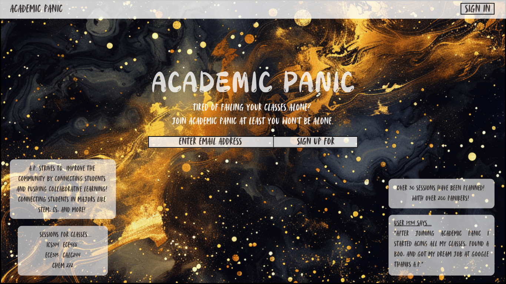
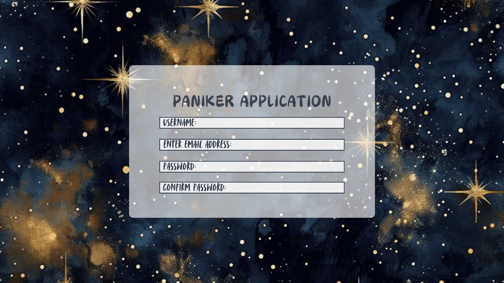
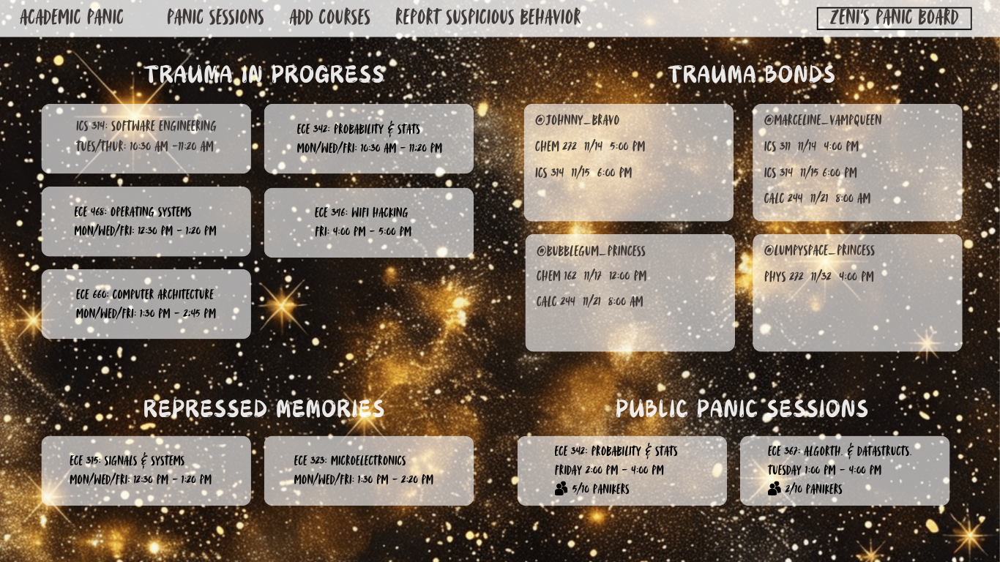
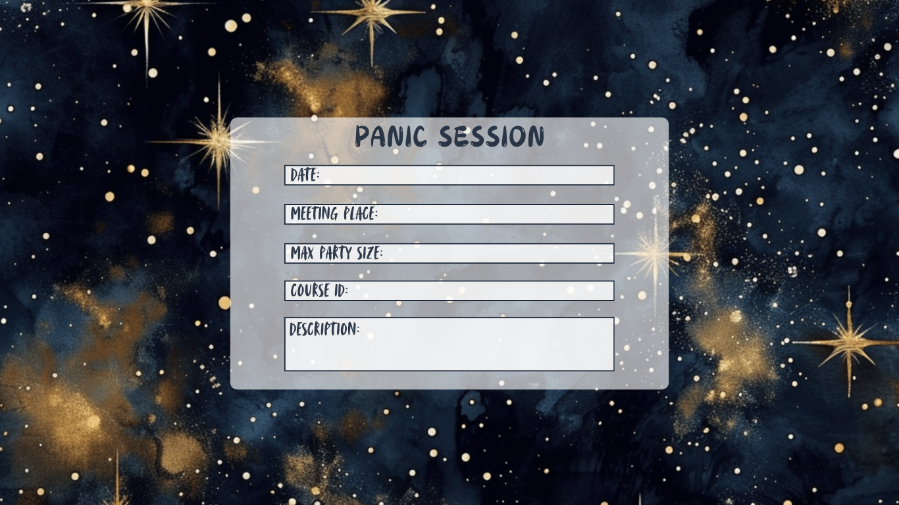
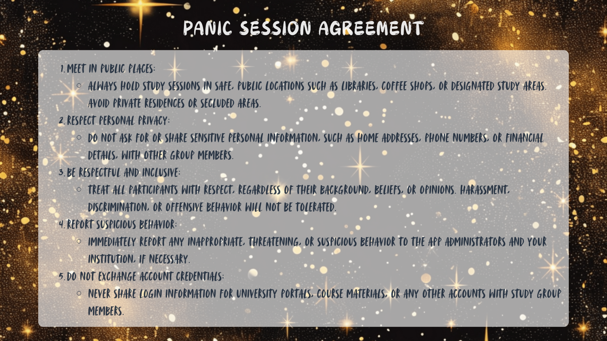

<!-- # Academic Panic -->
[](https://github.com/Academic-Panic/academic-panic-application/actions/workflows/ci.yml)
## Table of contents

- [Overview](#overview)
- [Goals](#goals)
- [User Guide](#user-guide)
- [Mockups](#mockups)
- [Application Screenshots](#application-screenshots)
- [Milestones](#milestones)
- [Deployment](#deployment)
- [Community Feedback](#community-feedback)
- [Technologies Used](#technologies-used)
- [Developer Guide](#developer-guide)
<!-- - [Team](#team) -->
- [Team Contract](#team-contract)
- [Team Organization](#team-organization)


## Overview

Academic Panic is a web application for UH Manoa students to connect with their
peers to engage in more effective and collaborative learning with
- a study session planning system that can notify other students of
- a course review and rating system
- a "friends" system to connect students without disclosing sensitive
information

## Goals

The goals of the project are as follows:
- provide UH Manoa students with a collaborative study/tutoring resource,
- encourage networking and community amongst UH Manoa students, and
- provide a platform for students to share honest (yet respectful) opinions
about courses that will be visible by all users.

## User Guide
### Landing Page
This is our landing page where you can log in or sign up with the buttons indicated


### Log In
If you click the log in button it will prompt you to enter your email and password


### Sign Up
If you click the sign up button it will prompt you to enter username, email, password, and confirm password. User can then use the register button to sign up or reset to clear the sections. Also has the option to have the user sign in if they already has an account

### Panic Board
Once logged in, the home page or panic board, has "Traum in Progress" that will have the courses currently taking, "Trauma Sessions" which will show all of the study sessions they have, and "Repressed memories" with previous classes. This page can also be found by clicking "Academic Panic" in the navbar.


### NavBar - Courses
Clicking the courses dropdown you 

- User visits webpage inspired by GitHub's design and sees landing page
displaying planned sessions and participants count.
- User creates account with email/username, password, potential headshot, and
course table (course name, year, semester, instructor, TA/grader checkboxes,
passion checkbox).
<!-- - Account creation may generate a unique ID number. -->
- Landing page updates to display planned sessions for friends and public.
- User can create a study session by filling out details like course, location,
date & time, purpose, and privacy (public or friends-only).
<!-- - Friends-only broadcasts share all information with applicable users, while -->
<!-- public broadcasts hide details until the user commits to attending. -->
- "My Profile" page allows user to view/edit current courses, see friends, and
add them via email/ID number (friendships formed through mutual requests, no
confirmation system).
<!-- - User can rescind friend request or terminate friendship on friends' list. -->


## Mockups
### Landing Page Mockup


### Application(Sign Up) Page Mockup


### Sessions Page Mockup


### Add Session Page Mockup


### Agreement/Rules Page Mockup


## Application Screenshots
### Milestone 1 Screenshots
#### Landing Page


#### Sign Up Page


#### Log In Page


#### Add Course Page


#### Agreement Page


## Milestones
[M1 Project Page](https://github.com/orgs/Academic-Panic/projects/1/views/1) - Milestone 1 Issues

[M2 Project Page](https://github.com/orgs/Academic-Panic/projects/3) - Milestone 2 Issues

[M3 Project Page](https://github.com/orgs/Academic-Panic/projects/4) - Milestone 3 Issues

## Deployment
Our application is deployed on vercel in the following link, [Academic Panic](https://academic-panic-application-do4b81n2z-21chaanos-projects.vercel.app)

## Community Feedback

## Technologies Used

Academic Panic is built upon the
[nextjs-application-template](https://ics-software-engineering.github.io/nextjs-application-template/),
which employs the following technologies:

- [React](https://reactjs.org/) for component-based UI implementation and
routing,
- [React Bootstrap](https://react-bootstrap.github.io/) as a CSS Framework for
UI design,
- [Next.js](https://nextjs.org/) as a web framework built on top of React with
additional structures, featuers, and optimization,
- [React Hook Form](https://www.react-hook-form.com/) for form development,
- [NextAuth.js](https://next-auth.js.org/) for user registration, authorization,
and authentication,
- [Sweet Alert](https://sweetalert.js.org/) for successful/failed database
updates, and
- [ESLint](http://eslint.org/) for consistent code quality using the [Next.js ESLint
Rules](https://nextjs.org/docs/app/building-your-application/configuring/eslint)
and the [AirBnB Javascript Style Guide](https://github.com/airbnb/javascript).

Additionally, we will use [Vercel](https://vercel.com/) as our deployment
platform.

[](https://github.com/Academic-Panic/academic-panic-application/actions/workflows/ci.yml)


## Developer Guide

## 1. Project Overview

### Mission Statement
- To help students transform their study habits by connecting them with peers for smarter, more effective learning through shared insights and collaborative teaching.

### Core Features
- Creating, joining, and viewing study sessions.
- Displaying past and current classes.
- Allowing students to express their level of interest or struggle in topics.
- Allowing students to limit study sessions to friend-requested peers only.

### Target Audience
This web application is intended for college students in STEM at the University of Hawaii at Manoa, including TAs. This web application is not intended for University staff to create accounts and use in class as a mandated tool. Professors caught using this web application as part of class in a mandatory way will be banned if reported.

---
<br><br>

## 2. Technical Specifications

- **Technology Stack:**
  - Frontend: React, Next.js
  - Backend: Node.js
  - Database: PostgreSQL, Prisma
  - Hosting and Deployment: Vercel, GitHub

- **APIs:**
  - Google Calendar

---
<br><br>

## 3. System Architecture

- **Diagrams:** Include a high-level system architecture diagram showing how different components interact (frontend, backend, database, etc.).
- **Data Flow:** Document the flow of data (e.g., user creating a session, data storage, retrieval).

*This image is temporary and will be recreated.*

---
<br><br>

## 4. Feature Details

### Paniker Application
- **Technical Implementation:** Using the `User` data structure in the Prisma Schema. A `username` field was added to allow users to create unique identifiers viewable by other users.

### Add Course
- **Technical Implementation:** Propagates course modifications to other app pages like `Add Stuff` and `Edit Stuff`.
-  - **Future Feature:** Enforce students to verify their enrollment through transcripts or student ID.

### Create Session
- **Technical Implementation:** Allows users to modify the session model [a structure that is based on the model course structure] in the Prisma Schema.

### User Agreement
- **Technical Implementation:** Prompts users to agree to safety guidelines upon creating or joining a session, regardless of friendship status. Encourages vigilance against malicious users.

### Reporting Page
- **Technical Implementation: Allows users to report suspicious activity. Reported users may be suspended for investigation. Includes proactive monitoring for users with suspicious activity.
- Future Feature** Create an algorithm that detects suspicious behavior [based on certain parameters] and adds users who meet criteria to a suspicious user list. If this user is reported they will automatically be kicked from Academic Panic. Kicked suspicious users will have a month to contest the report.
- Students who report users will have the oppertunity to opt for the report to be sent to the campus police to keep on file.

### View Sessions
- **Technical Implementation:** Renders a single row in the Session table. See `listSession/page.tsx`. Allows users to view publicly tagged sessions. 

### Student Panic Boards
- **Technical Implementation:** Displays current and past courses, current sessions, and related public sessions on a private dashboard visible only to friends.

---
<br><br>

## 5. Database Schema

These graphs represent the dependencies in our database.

### Schema Prisma


### Application


### Components


### Utilities


### API


### Application Layout


---
<br><br>

## 6. Development Workflow

### Documentation In Code
- Use **ESLint** to ensure consistent code style.
- Comments in code should be clear and concise. For pieces of code that require more detailed explanation your comment must begin with the keyword: RATIONALE. This will allow for easy searching on github. 

### Variable Naming
- Use backslashes when possible. Otherwise use stars and make it look pretty
- Use **camelCase** for variable names:
  - Examples: `userName`, `sessionId`
- Types should start with an **uppercase letter**:
  - Example: `User`, `Session`
- Avoid ambiguous names. Use descriptive identifiers:
  - Good: `courseName`
  - Bad: `cn`
- Add headers for structures/functions etc.. briefly explaining parameters and 
  functionality

### File and Folder Organization
- Group related files in appropriately named directories:
  - Example:
    ```
    components/
    pages/
    utils/
    ```
- Name files in lowercase with hyphens for separation:
  - Example: `session-manager.js`

### Commenting Guidelines
- Use comments to explain non-obvious logic and intent.
- For detailed explanations, start comments with the keyword `RATIONALE`.
- Standard format for functions:
  ```javascript
  /**
   * @brief Adds a new session to the database.
   * @param {string} sessionName - Name of the session.
   * @param {Date} startTime - The session start time.
   * @details Uses Prisma ORM to interact with the database.
   * @return {Promise<boolean>} - True if the operation succeeds, false otherwise.
   */
  ```
  - Align comments in blocks:
   EXAMPLE:
   ```
   memset (&if_, 0, sizeof if_);                            // Initialize the interrupt frame.
   if_.gs = is_.fs = if_.es = if_.ds = if_.ss = SEL_UDSEG;  // Set the segment registers.
   if_.cs = SEL_UCSEG;                                      // Set the code segment register.
   if_.eflags = FLAG_IF | FLAG_MBS;                         // Set the EFLAGS register
   success = load (file_name, &if_.eip, &if_.esp);          // Load the executable
   ```
- Keep it Nelson [ Professor Mark Nelson Documentation Style ]

---
<br><br>
    
## 7. Setup Instructions

- Go to the Academic Panic Repo https://github.com/Academic-Panic/academic-panic-application.git
- Clone the repository
- cd into Academic Panic’s app directory and install dependecies with: npm install
- Run the development server: npm run dev
- Lint the code: npm run lint

---
<br><br>

## 8. Testing Guidelines
  
  - testing frameworks and tools: Playwright, ESlint
  - Instructions for running tests: State by state tests are required due to the     
    limitations of playwright.

---
<br><br>

## 9. Deployment Guide:

  - Steps to deploy the application to production: Milestone 1, Milestone 2, Milestone     3.
  - Tools for continuous integration and deployment (CI/CD): Github

---
<br><br>

## 10. Future Development

  - Description: Google Calendar for student session reminders.
        -Technical Implementation: The Google Calendar API is a programmatic interface that allows authorized applications to interact with Google Calendar data. It can be used for: Event 
         management, Calendar management, Integration, Automation, and Data access.
  - You can access the Google Calendar API through: Explicit HTTP calls and The Google Client Libraries.
  - To enable an API in Google Calendar, you can
      - Go to the API Console
      - Select a project or create a new one
      - Open the console left side menu and select APIs & services, and then select Library
      - Click the API you want to enable
      - Click ENABLE
      - Dependencies: Libraries, frameworks, or APIs involved.

   - Description: Enforce Enrollment
       - Techincal Implementation: Enforce students to verify their enrollment through transcripts or student ID.

   - Description: Suspicious Behavior Reporting Page
       - Technical Implementation:
           - Create an algorithm that detects suspicious behavior [based on certain parameters] and adds users who meet criteria to a suspicious user list. If this user is reported they will automatically be kicked from Academic Panic. Kicked suspicious users will have a month to contest the report. Students who report users [specifically users who have harrased them in IRL] will have the oppertunity to opt for the report to be sent to the campus police to keep on file. All students are encouraged to report suspicious behavior to campus police, in relation to Academic Panic users engaging in suspicious or malicious behaviors.
        
   - Description: Course Rating System
       - Technical Implementation:
           - Students will be able to rate courses annonymously. This includes a rating system that evaluates the course material, textbooks, homework, difficulty, professor, resource accesibility. The intention for the course rating system is place the power of transparency back in the students hands and hold the university and professors accountable while also preparing future students.
           - Academic Panic will be using algorithms that do not allow for foul language. Students will be encouraged to remain professional for the sake of credibility and seriousness.
  

###  limitations or areas requiring optimization:
  ### **Security**
  - **Limitations**:
    - Vulnerabilities to SQL Injection, XSS, CSRF, or data breaches.
    - Improper user authentication or session management.

  - **Optimization**:
    - Use prepared statements and parameterized queries to prevent SQL injection.
    - Sanitize and validate all user inputs.
    - Implement HTTPS, secure cookies, and proper CORS policies.
    - Use modern authentication practices (e.g., OAuth, JWT).


---
<br><br>

## 11. Collaboration Guidelines  

  ### Contribution guidelines for new developers: 
  - Academic Panic will be made available for Universities to use for their student        body.
  - Universities will be expected to follow the original intention for Academic Panic:
      - Academic Panic was created for students by students.
      - Academic Panic does not support professors intending to use the app as part of         their curriculum or in any way that contradicts our mission statemnent.
---
<br><br>

For details, please see http://ics-software-engineering.github.io/nextjs-application-template/.


## Team Contract
[Academic Panic Contract](https://docs.google.com/document/d/1t8T_RfazQbLVfYcnKgaXLSmiIFlE0KpDmrwTd28IiKA/edit?tab=t.0#heading=h.cwlg4wpeg4ei)

## Team Organization
[Academic Panic Organization page](https://github.com/Academic-Panic)
